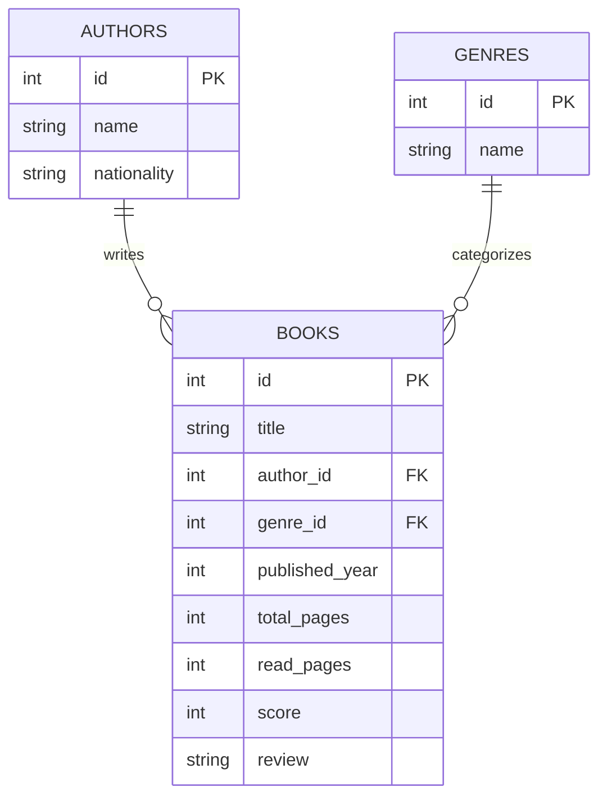

# Personal Library Manager

## Descripción

Personal Library Manager es una aplicación web desarrollada en Python para gestionar una biblioteca personal.

La aplicación permite administrar libros, autores y géneros, registrar progreso de lectura, asignar puntuaciones y escribir reseñas. El sistema está compuesto por un backend REST construido con FastAPI, una base de datos PostgreSQL en Supabase y una interfaz web desarrollada con Streamlit.

---

## Tecnologías utilizadas

- Python 3.11+
- FastAPI
- Streamlit
- Supabase (PostgreSQL)
- Pydantic
- Pytest
- Ruff
- Radon
- MkDocs Material
- GitHub Actions

---

## Arquitectura

El proyecto sigue una arquitectura por capas con separación clara de responsabilidades.

| Capa | Responsabilidad |
|--------|--------|
| api | Endpoints HTTP |
| services | Lógica de negocio |
| repositories | Acceso a datos |
| schemas | Validación y contratos de datos |
| core | Configuración y excepciones |

---

## Estructura del proyecto

```text
personal_library/
│
├── src/
│   └── personal_library/
│       ├── api/
│       ├── services/
│       ├── repositories/
│       ├── schemas/
│       ├── models/
│       └── core/
│
├── interfaces/
│   └── gui/
│       └── streamlit_app.py
│
├── tests/
│
├── docs/
│
└── mkdocs.yml
```

---

## Modelo Entidad Relación



---

## Variables de entorno

Crear un archivo `.env` en la raíz del proyecto:

```env
SUPABASE_URL=https://your-project.supabase.co
SUPABASE_KEY=your-supabase-key
```

---

## Instalación

Clonar el repositorio:

```bash
git clone https://github.com/usuario/personal_library.git
cd personal_library
```

Instalar dependencias:

```bash
uv sync
```

---

## Ejecutar Backend

Iniciar la API REST:

```bash
uv run uvicorn src.personal_library.api.main:app --reload
```

Documentación automática:

### Swagger

```text
http://127.0.0.1:8000/docs
```

### ReDoc

```text
http://127.0.0.1:8000/redoc
```

---

## Ejecutar Frontend

Iniciar Streamlit:

```bash
streamlit run interfaces/gui/streamlit_app.py
```

---

## Funcionalidades

### Gestión de Libros

- Crear libros
- Consultar libros
- Actualizar libros
- Eliminar libros
- Actualizar progreso de lectura
- Actualizar reseñas
- Actualizar puntuaciones
- Consultar libros por autor
- Consultar libros por género

### Gestión de Autores

- Crear autores
- Consultar autores

### Gestión de Géneros

- Crear géneros
- Consultar géneros

---

## API REST

### Endpoints de Libros

| Método | Endpoint |
|----------|----------|
| GET | /books |
| GET | /books/{id} |
| POST | /books |
| PUT | /books/{id} |
| DELETE | /books/{id} |
| PATCH | /books/{id}/progress |
| PATCH | /books/{id}/review |
| PATCH | /books/{id}/score |
| GET | /books/author/{author_id} |
| GET | /books/genre/{genre_id} |

### Endpoints de Autores

| Método | Endpoint |
|----------|----------|
| GET | /authors |
| POST | /authors |

### Endpoints de Géneros

| Método | Endpoint |
|----------|----------|
| GET | /genres |
| POST | /genres |

---

## Calidad de Software

### Ejecutar pruebas

```bash
uv run pytest
```

### Ejecutar Ruff

```bash
uv run ruff check .
```

### Ejecutar Radon

```bash
uv run radon cc src -a
```

---

## Documentación

La documentación se genera automáticamente utilizando MkDocs Material y se despliega mediante GitHub Pages.

---

## Características de Calidad

- Arquitectura por capas
- Clean Code
- Validación con Pydantic
- Testing automatizado
- Integración continua con GitHub Actions
- Documentación automática con MkDocs
- API REST documentada con Swagger y ReDoc
- Persistencia en PostgreSQL mediante Supabase

---

## Estado del Proyecto

✅ Backend FastAPI funcional

✅ Frontend Streamlit funcional

✅ Integración con Supabase

✅ CRUD completo

✅ Testing automatizado

✅ Linter configurado

✅ Documentación automática

✅ Arquitectura limpia

✅ API documentada

