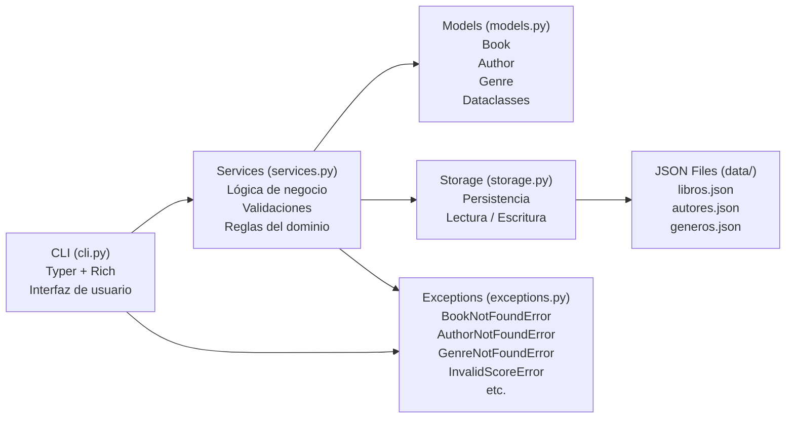
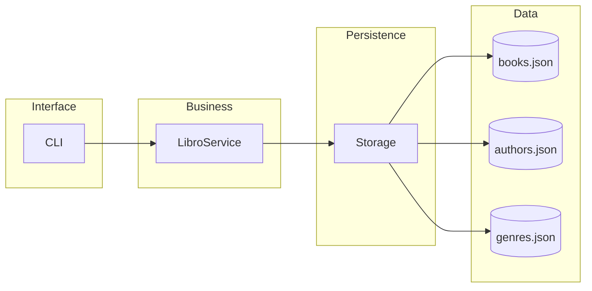
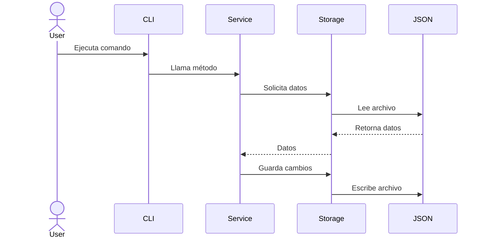

# Arquitectura del sistema

Este proyecto sigue una arquitectura por capas (layered architecture) que separa responsabilidades para mejorar la mantenibilidad, escalabilidad y claridad del código.

---

## Vista general

## Descripción de las capas

### CLI (Interfaz)

Se encarga de:

- Recibir comandos del usuario

- Validar parámetros de entrada básicos

- Invocar los métodos del servicio

**Ejemplo:** add_book(title, author, genre)

### Service (Lógica de negocio)

Contiene la lógica principal de la aplicación:

- Creación de entidades

- Validaciones de negocio

- Orquestación de operaciones

**Ejemplo:** LibroService.add_book()

### Storage (Persistencia)

Encapsula el acceso a datos:

- Lectura de archivos JSON

- Escritura de archivos JSON

- Manejo de múltiples recursos

### Data (Almacenamiento)

El sistema utiliza archivos JSON separados por entidad:

- books.json

- authors.json

- genres.json

Esto permite:

- Separación de datos

- Mejor organización

- Escalabilidad

## Flujo de ejecucion

## Desiciones de diseño

### Uso de src layout
El proyecto utiliza la estructura src/ para:

- Evitar problemas de importación

- Separar código fuente de configuración

### Separación por capas

Cada módulo tiene una responsabilidad única:

- CLI -> interfaz

- Service -> lógica

- Storage -> persistencia

Esto sigue el principio de **Single Responsibility**.

### Modelos con dataclasses

Los modelos se implementan como dataclasses para:

- Reducir código boilerplate

- Facilitar serialización

- Mejorar legibilidad

### Validaciones en modelos

Se utilizan métodos ___post_init___() para validar:

- Datos obligatorios

- Consistencia de objetos