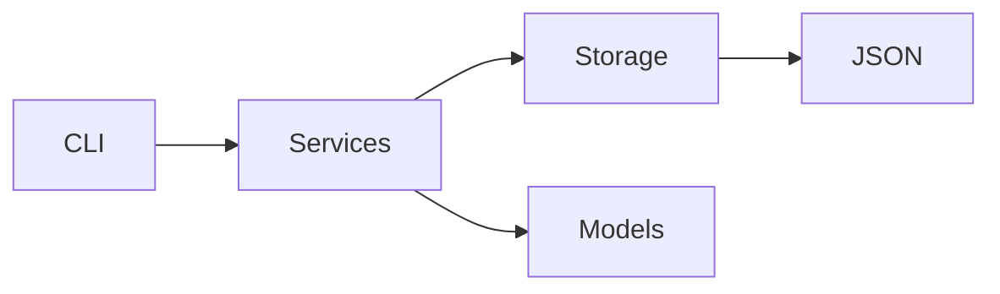
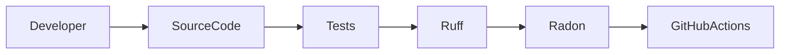

# Guía de desarrollo

Esta guía explica el funcionamiento interno de la aplicación de línea de comandos para gestionar la libreria personal.

## Arquitectura del proyecto



## Workflow de desarrollo



## Testeo

El proyecto incluye pruebas unitarias usando pytest.

### Ejecutar pruebas

```bash
uv run pytest
```

Todas las pruebas deben pasar correctamente.

## Análisis estáico de código

Se utiliza ruff para análisis estático de código.

```bash
uv run ruff check .
```

## Complejidad ciclomática

El proyecto utiliza Radon para medir complejidad ciclomática.

```bash
uv run radon cc src -a
```

## Validaciones implementadas

- No se permite agregar libros con autor inexistente
- No se permite agregar libros con género inexistente
- Las páginas leídas no pueden superar el total
- El puntaje debe estar entre 1 y 5
- No se permiten IDs duplicados
- Manejo de errores mediante excepciones personalizadas

## Validaciones en modelos

Las validaciones se implementan utilizando:

```python
__post_init__()
```

y métodos auxiliares privados.

## Requisitos

- Python >= 3.11
- uv
- pytest
- typer
- rich
- ruff
- radon

