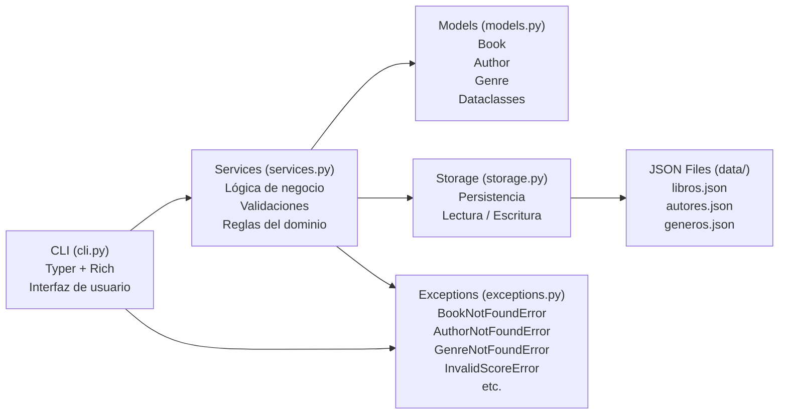
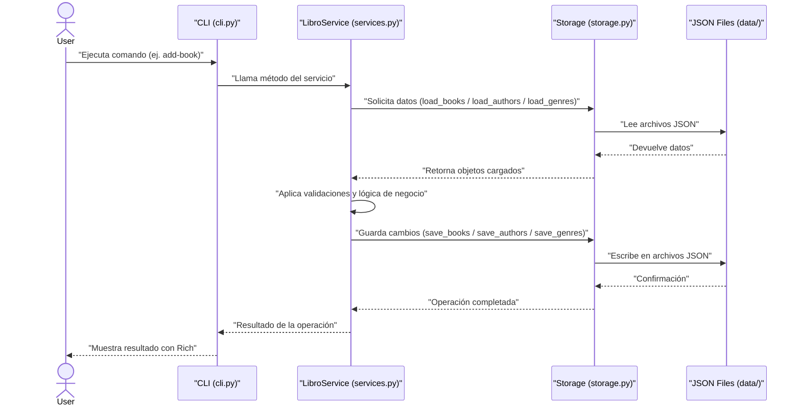

# Personal Library Managment CLI

Bienvenido a la documentación oficial de **Personal Library Managment**, una aplicación
de línea de comandos desarrollada en Python para gestionar una libreria personal utilizando
principios de **Clean Code**, **Testing** y **Arquitectura modular**.

## Características

- CLI moderna basada en **Typer**
- Persistencia de datos en archivo JSON
- Arquitectura modular (`src layout`)
- Pruebas unitarias con `pytest`
- Uso de **mocks** para aislar dependencias
- Excepciones personalizadas
- Principios de diseño **SOLID**
- Documentación generada automáticamente

## Arquitectura del sistema



## Estructura del sistema
```bash
personal_library/
├── README.md
├── pyproject.toml
├── uv.lock
├── main.py
├── data
│   ├── libros.json
│   ├── autores.json
│   └── generos.json
├── src
│   └── my_app
│       ├── __init__.py
│       ├── cli.py
│       ├── models.py
│       ├── services.py
│       ├── storage.py
│       └── exceptions.py
└── tests
    ├── __init__.py
    ├── conftest.py
    └── test_services.py
```

## Flujo general de ejecución


## Documentación

Esta documentación está dividida en tres secciones principales:

| Sección         | Descripción               |
| --------------- | ------------------------- |
| Guía de Usuario | Cómo usar la aplicación   |
| Instalación     | Cómo instalar el proyecto |
| API             | Documentación del código  |

!!! tip "Recomendación"
    Si es tu primera vez usando el proyecto, comienza por la sección **Guía de Usuario**.

