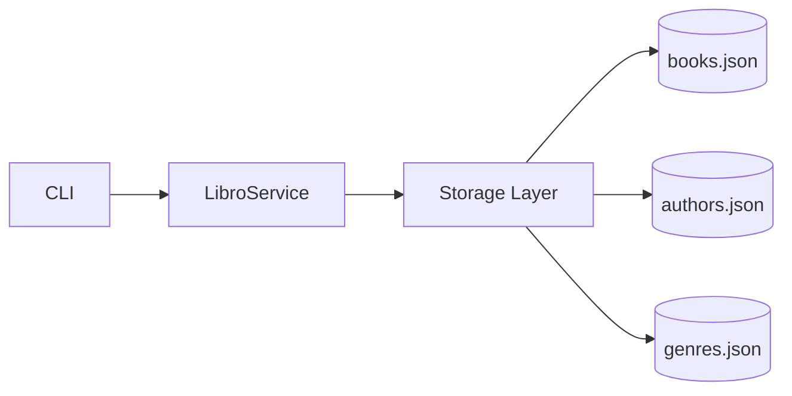

# Persistencia

Los datos se almacenan en archivos JSON dentro de la carpeta:

data/

Archivos utilizados: - libros.json - authors.json - genres.json

Esta aplicación utiliza un sistema de persistencia basado en archivos JSON para almacenar la información de libros.

---

## ¿Cómo funciona?

La capa de persistencia está implementada en el módulo `Storage`, el cual se encarga de:

- Leer datos desde archivos JSON
- Escribir datos en archivos JSON
- Abstraer el acceso a disco del resto de la aplicación

---

## Arquitectura

